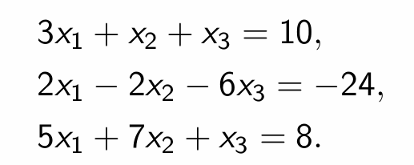
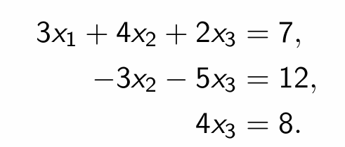
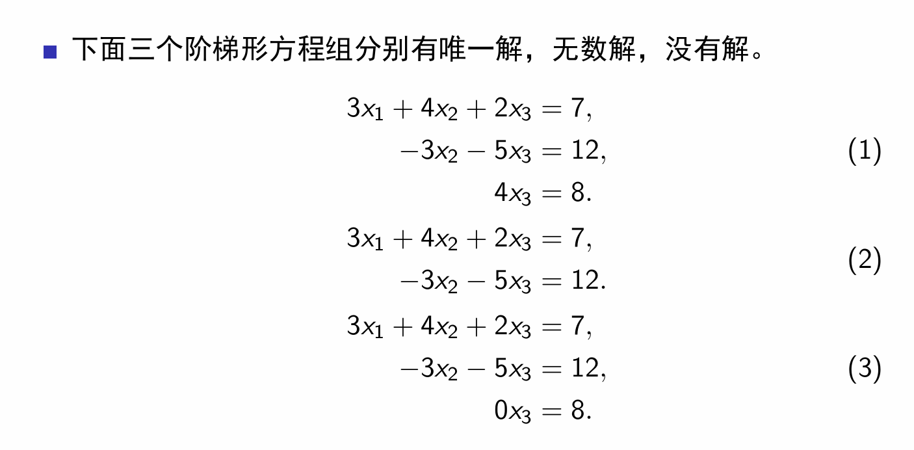
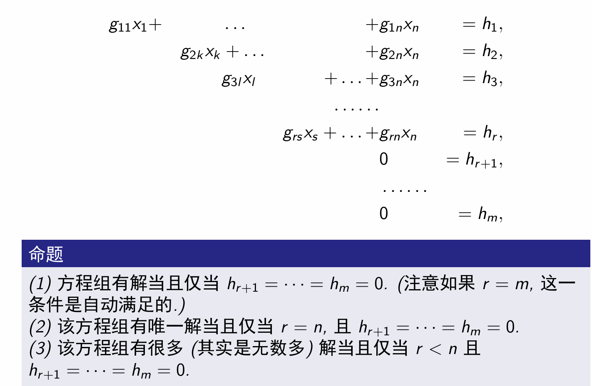
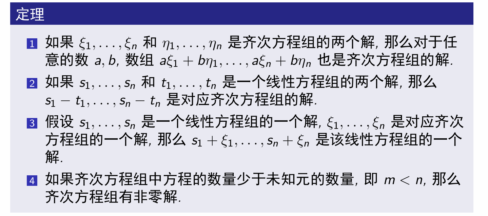

# Week1习题课讲义
Penghao Kuang

### 线性方程组解的意义（空间视角）

$3x_1+x_2+x_3=10$：空间中的平面
有解：存在点同时落在以上三个平面中
即：只要是三个平面共同相交的部分，所有交点即为解

### 高斯消元的设计动机（代数视角）

上面是期望看到的形式。（能够分离$x_1 x_2 x_3$）（高斯消元第二阶段）
如何转化成阶梯型？（高斯消元第一阶段）（逐个击破）

涉及的都是初等变换。

Q：为何这些初等变换合理？
1.$x_1+x_2+x_3=1$
2.$2x_1+3x_2+4x_3=5$

更改方程2:
$x_2+2x_3$=$(2x_1+3x_2+4x_3=5)+(-2)(x_1+x_2+x_3=1)=3$

判断依据：交线是否改变。

代数验证：
* 交线上的点如果能使得原方程组成立，则一定能使新的方程组成立
* 交线上的点如果不能使原方程组成立，则一定不能使新的方程组成立$\Rightarrow$交线上的点如果能使新方程组成立，则一定能使原方程组成立（证逆否命题）（证明if P $\Rightarrow$ Q等于证明if not Q $\Rightarrow$ not P ）

可证交线不改变$\Rightarrow$空间上理解为：更改后的方程在空间上仅仅绕着交线做了旋转，对于交线的求解没有任何影响

**扩展：研究对象可能为更高维空间**

### 初等变换收尾（空间视角）
1、2型初等变换（交换位置&倍数相加）
* 交换位置不影响两相交向量空间的相交情况
* 倍数相加不影响两相交空间的交空间

### 有解性与解空间理解（代数与几何视角）

代数理解：自由元素数量
（1）：未约束时：$x_1 x_2 x_3$均自由取值
约束后：均可转化成固定值
（2）：约束后：
$x_1+ax_3=a'$
$x_2+bx_3=b'$
即：一旦$x_3$确定，则$x_1,x_2$均能被确定。但$x_3$无法确定，则$x_1 x_2$均随$x_3$取值出现无穷多可能。
解为一个参数方程：
$x_1=a'-at$
$x_2=b'-bt$
$x_3=t$
一维空间。

（3）：约束后：无解
（主未知元、自由变量）

空间理解1：为何出现0=非零$h_m$
方程组：
$x_1+x_2=1$
$2x_1+3x_2=4$
$3x_1+4x_2=6$

12初等变换：$x_2=2$（旋转至有一元不再起作用）
13初等变换：$x_2=3$
23初等变换：$0=1$
即：两个空间不再存在交空间，已经不符合“沿交空间旋转”的前提

空间理解2：自由变量的减少&解空间的降维

（1）方程组：每一个方程都带来了解空间的有效约束，每一次有效约束都导致解空间维度下降1，直至下降到0维，即唯一解
（2）方程组：每一个方程都带来了解空间的有效约束，每一次有效约束都导致解空间维度下降1，直至下降到一维。所以有一个自由变量，所有解在空间上形成一维子空间。
方程组：
$3x_1+4x_2+2x_3=7$
$-3x_2-5x_3=12$
$3x_1+x_2-3x_3=19$（前两个方程线性组合）
即：第三个方程无法对已形成的交线再形成有效约束，而是囊括了交线的内容
（阶梯型中0=0的由来）

推论：有解时：每个方程可能降1或0维。

### 齐次方程组

定理0：一定有解（不存在0=非零h_m，各约束空间至少交于原点）
定理4：解不为0维：包含非零解
定理123：自己复习

### 增广矩阵求解高斯消元&二三阶行列式与方程的解
自己复习

### 向量空间
PS：什么是向量？$\Rightarrow$任何事物的定量表征方式（例如n维空间中点的坐标，用n维向量表征）$\Rightarrow$空间视角的描述工具是向量，代数视角的描述工具是方程

Ex1:向量空间中的任何向量都由已有向量通过线性组合张成（v3 v4向量，直至该二维空间中所有向量）。
Ex2:向量空间中任何向量可以有特定几个向量承担全部的张成任务（仅通过v1 v2，就可以生成该二维空间中所有向量）
Ex3:线性子空间小于等于$R^n$向量空间。想象该平面为三维空间中平面（v均为三维表征），则子空间为2维，无法表征$v_5$

### 线性相关与无关
Ex1:只有v1向量：只能张成一个一维空间
Ex2:只有v2向量：能长成一个二维空间；v1 v2之间不可通过线性运算互相表示（v1 v2向量集合线性无关）
Ex3:依次加上v3 v4向量：v3能被v1 v2线性组合，v4能被v1v2/v1v2v3线性组合表示。仍是只能张成二维空间。(向量集合线性相关)
$\Rightarrow$公式推导：推导为线性相关的定义式：a1x1+a2x2+a3x3+a4x4=0，(a1,a2,a3,a4)的解不全为0
Ex4:在v1 v2基础上再加v5：都不存在其中一个向量能被另外两个向量相互表示；能长成三维空间。

通俗理解：线性相关：集合中存在向量能被其他向量表示$\Rightarrow$对于表示空间张成没有作用；线性无关：没有任何一个向量能被其他向量线性表示$\Rightarrow$能够张成一个新的维度

Ex_Final：转向代数视角（方程）（解空间）
$x_1=(x_{11},x_{12},x_{13})$
$x_2=(x_{21},x_{22},x_{23})$
$x_3=(x_{31},x_{32},x_{33})$
$a_1x_1+a_2x_2+a_3x_3=0$$\Rightarrow$
$x_{11}a_1+x_{21}a_2+x_{31}a_3=0$
$x_{12}a_1+x_{22}a_2+x_{32}a_3=0$
$x_{13}a_1+x_{23}a_2+x_{33}a_3=0$

若$x_3$不能被$x_1 x_2$线性表示：齐次方程仅有0解
若线性相关？$x_3=c_1x_1+c_2x_2$……