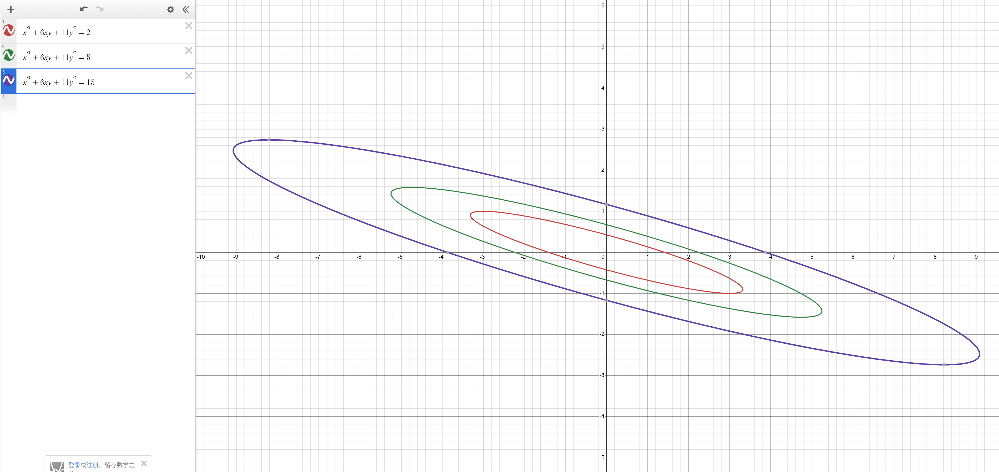
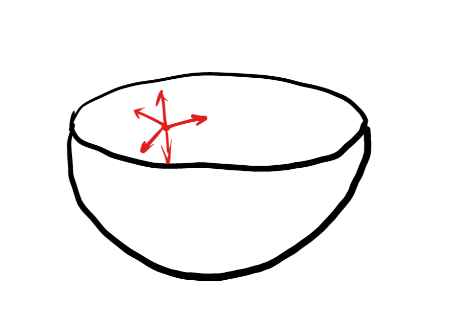
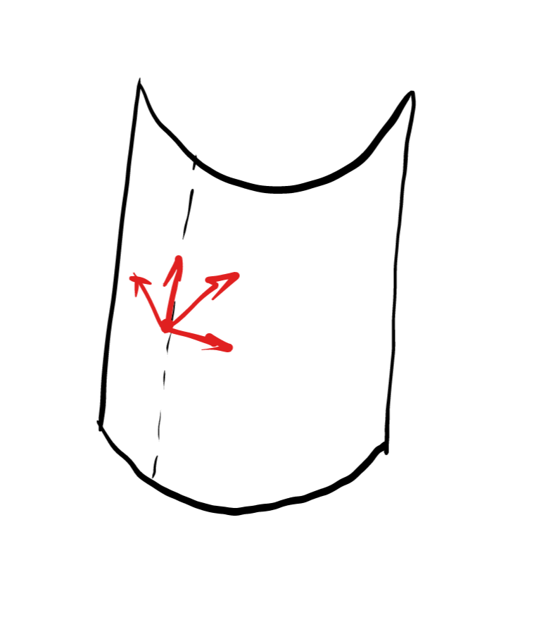
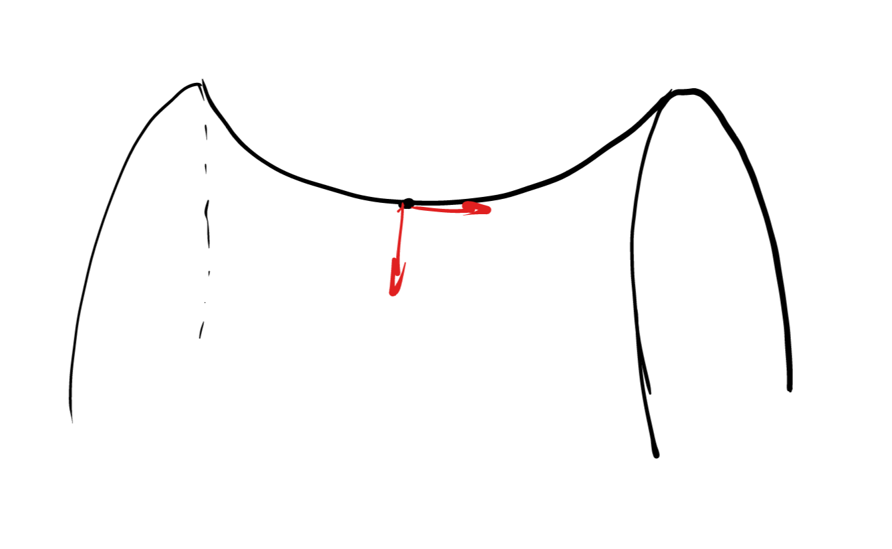
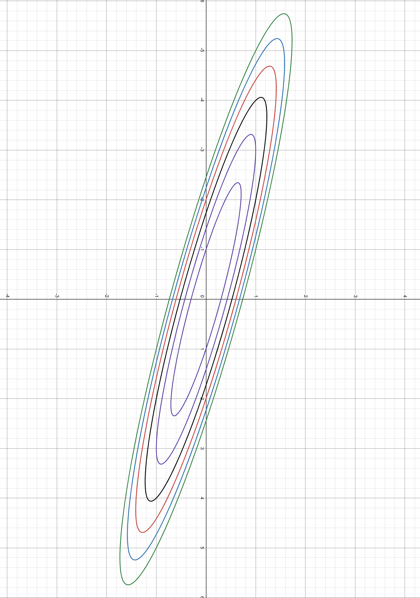

# Week10习题课讲义

Topic：二次型与典范性的直观理解、二次型&典范性与变量耦合性的结合、正定性的直观理解

### 如何理解二次型矩阵

$x_1^2+x_2^2=f$，如何写成向量&矩阵形式？
$[x_1,x_2]    \begin{bmatrix}x_1\\x_2\end{bmatrix}=f$
$[x_1,x_2]  I  \begin{bmatrix}x_1\\x_2\end{bmatrix}=f$

$x_1^2+6x_1x_2+11x_2^2=f$?
$x_1(x_1+3x_2)+x_2(3x_1+11x_2)=f$
$[x_1+3x_2,3x_1+11x_2]\begin{bmatrix}x_1\\x_2\end{bmatrix}=f$
$[x_1,x_2]\begin{bmatrix}1&3\\3&11\end{bmatrix}\begin{bmatrix}x_1\\x_2\end{bmatrix}=f$
对角线：完全平方项的系数
非对角线：对称位置的和为交叉耦合项的系数。习惯上将其写作对称矩阵

Q：$x_1^2+6x_1x_2+11x_2^2=f \Rightarrow \vec{x}^TA\vec{x}=f$,其中 $\vec{x}=\begin{bmatrix}x_1\\x_2\end{bmatrix}$。这个二次型表达式的含义是什么？

回顾一次式：$f=A\vec{x}$，是一条线性曲线，曲线的形状恒定（线型），同一条线上共享函数值$f$。
二次型：一条二次曲线，曲线的形状仍然恒定，同一条线上共享函数值$f$。
总结：固定f的情况下是一条等值线。等值线的形状由函数表达式决定。

### 如何判定二次曲线的形态？
高中学过的圆锥曲线：变量之间严格分离。
能不能让二次曲线变成变量分离的形式？

$(x_1+3x_2)^2+2x_2^2=f$
$y_1^2+2y_2^2=f$
具体操作：
代数上讲：将$x$的耦合形式打包成分离的整体
几何上讲？
原先的一点$(x_1,x_2)$：在平面直角坐标系（基向量为$[1,0],[0,1]$）下，坐标为$x_1,x_2$
现在的一点$(y_1,y_2)$：在新的一个坐标系下（基向量暂时未知），坐标为$y_1,y_2$
如何求出基向量？
$\vec{y}=\begin{bmatrix}1&3\\0&1\end{bmatrix}\vec{x}$
$\Rightarrow \vec{x}=\begin{bmatrix}1&-3\\0&1\end{bmatrix}\vec{y}$
这个式子的意义：给定这一组新坐标y，进行线性组合后与原向量完全相等$\Rightarrow$列向量就是新的基向量组
即：只需要将$x\rightarrow y$的转换矩阵求逆。

在新的坐标系下的二次型：$[y_1,y_2]\begin{bmatrix}1&0\\0&2\end{bmatrix}\begin{bmatrix}y_1\\y_2\end{bmatrix}=f$
可观察出是椭圆（全为正）。同时：**这也是一个二次型的典范式！**

同理：如何判断$x_1^2+6x_1x_2+2x_2^2=f$的形态?基向量如何？

### 如何理解典范式？

矩阵形态与二次型表达式的关系：
矩阵非对角矩阵，则说明存在交叉耦合项；对角矩阵则说明只存在完全平方项。

交叉耦合项出现的原因：坐标系（基向量）的选取方式，使得二次曲线的表示中存在两基向量互相影响的现象。解耦合操作则找到了一组新的基向量，使得这组基向量足够合适，能够使得二次曲线的表示中，基向量之间能够相对独立的作用。

所以普通二次型转典范式的本质是**换基操作**。与之前线性变换唯一的不同之处在于问题变成了二次问题而非线性，但线性变换的基本规律始终不变。
* 基向量的改变会不会造成空间的改变？维数？矩阵的秩？
* 这种解耦基向量的取值是否唯一？为什么？

如何理解“相对独立”的作用？

### 一个数值最优化的例子
$f=x_1^2+x_2^2$,如何找到$x_1,x_2$，使得f取得最小值？
$f=x_1^2+6x_1x_2+11x_2^2$,如何找到$x_1,x_2$，使得f取得最小值？

我们考虑“固定$x_2$，先找$x_1$，使得$f$最小；再固定$x_1$，找$x_2$，使得$f$最小”
是否适用于两个例子？为什么？

对于例2，如何解决？
如果将下降方向，即坐标方向换成$y_1,y_2$对应的基向量方向？

这就是数值最优化中极为有名的**共轭梯度法**：每一个方向向量彼此在二次型空间中解耦合。

### 再探解耦基向量
什么是点积？
$\vec{u}^T\vec{v}$的绝对值大小，代表了两向量之间的耦合强度（投影分量大小）
广义的点积：
$\vec{u}^TI\vec{v}$：在I二次型中的向量耦合强度
$\vec{u}^TI\vec{v}=0\Rightarrow$ 在该二次型中，两个向量完全解耦合。
$A=\begin{bmatrix}1&3\\3&11\end{bmatrix}$
$\vec{u}^TA\vec{v}$:在A二次型中的向量耦合强度
$\vec{u}^TI\vec{v}=0$时，$\vec{u}^TA\vec{v}$可能不为0$\Rightarrow$存在耦合关系。
期望结果：$\vec{u}^TA\vec{v}=0\Rightarrow$在该二次型中，两向量不存在耦合关系。
例如：$[1,0]A\begin{bmatrix}-3\\1\end{bmatrix}=?$

也就是说：所有解耦基向量组，即典范基，都能满足：$\vec{u}^TA\vec{v}=0$
这也可以说明：典范基存在多组解。

### 总结
典范式存在的意义为：寻找一组新的基向量，使得这组新的基向量在该二次型函数中表现出解耦合的性质。在代数上体现为新的二次型矩阵为对角矩阵

### 直观理解矩阵正定性
从一元函数开始：
$f(x+h)=f(x)+hf'(x)+\frac{1}{2}h^2f''(x)$
$f'(x)$描述函数在此点的切线，$f''(x)$描述函数在此点的曲率。
$f''(x)<0$：向下弯曲，函数在x附近将小于切线值
$f''(x)>0$：向上弯曲，函数在x附近将大于切线值
$f''(x)=0$：不弯曲，函数在x附近将等于切线值

如果自变量是多元？
例如二元变量，将要考虑各个方向（$x_1$方向，$x_2$方向，交叉方向）
$f(\vec{x}+\vec{h})=f(\vec{x})+\nabla f(\vec{x})^T\vec{h}+\frac{1}{2}\vec{h}^T\nabla^2f(\vec{x})\vec{h} $

$hf'(x)$代表切线（仅单一方向），$\nabla f(\vec{x})^T\vec{h}$代表切面（2个方向张成的结果）。
$f''(x)$代表曲率（仅单一方向），$\nabla^2f(\vec{x})$也代表曲率（2个方向&交叉方向共同作用），不同的$\vec{h}$代表不同的方向，不同方向的曲率存在差异。

$\nabla^2f(\vec{x})$是一个矩阵，即“海森矩阵”。

如果$\vec{h}^T\nabla^2f(\vec{x})\vec{h}$恒正：往该点附近的任何方向看，曲线都“向上掰”（正定）
如果$\vec{h}^T\nabla^2f(\vec{x})\vec{h}$恒负：往该点附近的任何方向看，曲线都“向下掰”（负定）
如果$\vec{h}^T\nabla^2f(\vec{x})\vec{h}$恒$\geq 0$：往该点附近的任何方向看，曲线都“向上掰”或“与切面重合”（半正定）
如果$\vec{h}^T\nabla^2f(\vec{x})\vec{h}$恒$\leq 0$：往该点附近的任何方向看，曲线都“向下掰”或“与切面重合”（半负定）
如果$\vec{h}^T\nabla^2f(\vec{x})\vec{h}$正负不定：往该点不同方向看，可能存在不同的弯折情况。

即：函数曲面的正定性取决于海森矩阵的性质。

二次型的海森矩阵即为$A$矩阵。

