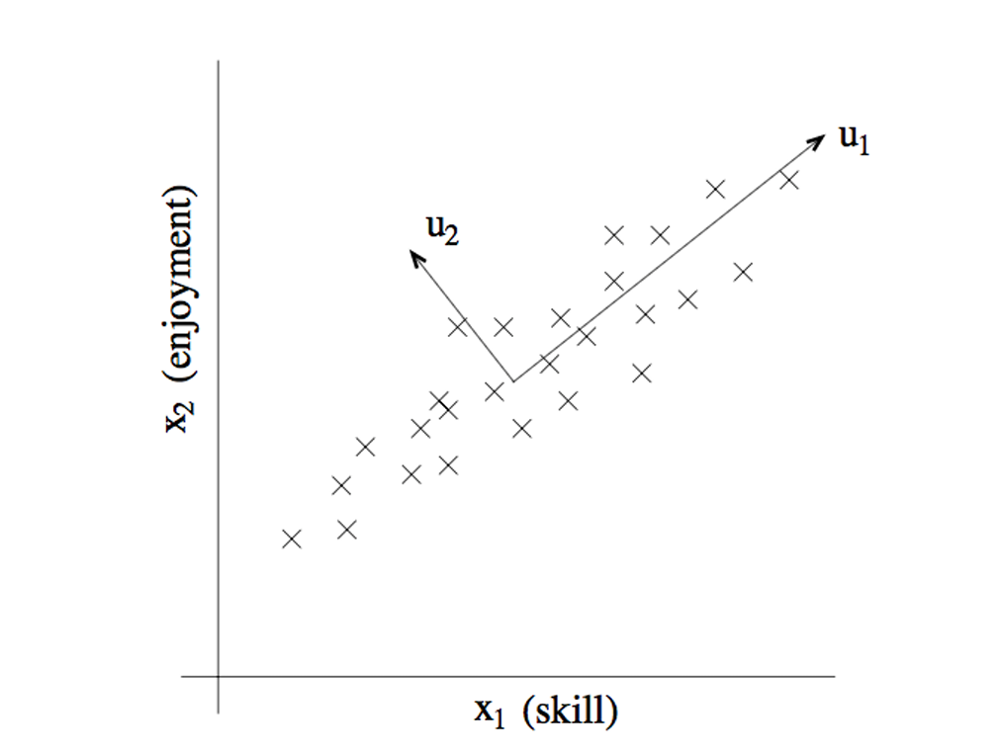

# Week12习题课讲义

Topic:线性映射算子与换基/换坐标问题的综合梳理、方阵对角化与特征值/特征向量的理解

### 概念引入：本体向量与坐标向量

Problem:平面直角坐标系中的向量$[1,1]$，在其他坐标系下的表示还是不是$[1,1]$？

坐标系本身是一个相对概念。就像物理中的参考系，通过不同的“相对视角”来描述同一个客观运动。

也就是说，空间中的向量本身是不会变的，就像现实世界中的运动，不会因为参考系的不同选取而在客观上发生改变。

所以，我们非常习惯的采用一种极其符合直觉的统一方式来描述这个本体的向量，也就是用标准的直角坐标系。（但注意，这也仅仅是约定俗成的一种形式化系统）这就相当于物理中的很多情境，习惯用“地面”作为一个“客观”的参考系。

所以我们可以引入**本体向量**这一概念，相当于用一种统一的参考标准，描述这个向量的具体指向。当我们有了本体向量的这种表征方法，就相当于：任何不同视角（即不同坐标系）下的向量，都可以转化到这种标准下统一比较。

而很多情况下，这种极其符合直觉的表示方法会在具体计算上遇到一些困难（就像在物理中，用地面系描述运动会在某些情况下变得复杂）。所以我们会考虑“换一种视角”，即采用另外的一种坐标系描述向量（相当于物理中的换参考系）。

在这个新的坐标系中，向量的表示方法肯定会发生改变。例如二维平面直角坐标系（也就是**本体向量**表示方式）下的向量$[1,1]$，在坐标系$\{[1,1],[-1,1]\}$下应被表示为$[1,0]$。我们对$[1,0]$这种新的向量表示，称之为**坐标向量**。

坐标向量与本体向量相对，表征了在另一坐标系看来，这一本体向量显现出的形态。这相当于物理中在另一参考系下呈现的运动状态。

所以我们也不难理解，当我们的坐标系就是标准的直角坐标系时，这个坐标系下的**坐标向量**就是**本体向量**。

### 基向量变换、坐标变换与线性算子的辨析与另一组“本体”“坐标”关系的引入

#### 1.基向量变换

基向量变换就是坐标系本身的变换。

原基向量组为$(\vec{u_1},\vec{u_2},……,\vec{u_n})$，新基向量组为$(\vec{v_1},\vec{v_2},……,\vec{v_n})$。可写作矩阵形式：$U,V$。如何描述这两组基向量之间的关系？

每一个新的$\vec{v_j}$都可以用之前的$u$向量描述：$\vec{v_j}=\sum_it_{ij}\vec{u_i} $。写成矩阵形式：$V=UT$。T矩阵的每一列代表对U向量组基向量线性组合的系数。即：第$j$列对应$\vec{v_j}$的生成。

#### 2.坐标变换

对于一个固定不变的本体向量$\vec{x}$，在坐标系U中的坐标向量为$[\vec{x}]_u$，在坐标系V中的坐标向量为$[\vec{x}]_v$。如何描述这两个坐标向量之间的关系？

本体向量不变：无论坐标系如何变换，都可以通过坐标系的基向量和坐标系中的坐标向量表示出本体向量。
$\Rightarrow \vec{x}=U[\vec{x}]_u=V[\vec{x}]_v $
$\Rightarrow \vec{x}=U[\vec{x}]_u=UT[\vec{x}]_v $
$\Rightarrow [\vec{x}]_u=T[\vec{x}]_v $
$\Rightarrow [\vec{x}]_v=T^{-1}[\vec{x}]_u $

即：坐标变换的变化法则正好与基向量变换的法则互逆。

最简单的理解：一维坐标系。基向量伸长后，坐标向量必须缩短才能保持“本体向量不变”的公理。
同理：向量空间的基向量发生了某种变化，只要这种变化可逆，坐标向量就一定要进行“逆变化”，才能保持“本体向量不变”。这种变化与逆变化的数学语言表示就是**矩阵及其逆矩阵**。

#### 3.线性算子

线性算子𝒜描述的其实也是一种“本体”性的变化：拉伸、旋转、剪切及更复杂的操作作用于这个向量的本体。无论采用什么坐标系，都不会对本体向量的改变造成影响。

那么对于线性算子𝒜这一“本体算子”，对应的“坐标算子”就是各个坐标系下的线性映射矩阵$A$。

例：
在平面直角坐标系中，对向量$[1,1]$施加线性算子𝒜。变换规则为：水平方向拉伸1倍，竖直方向压缩1倍。
可求出：两基向量的本体向量变换后的坐标向量为：$[2,0],[0.0.5]$。即此坐标系下的线性映射矩阵为：
$
\begin{bmatrix}
2&0\\
0&0.5\\
\end{bmatrix}
$

同样的线性算子，在坐标系$[1,1],[1,-1]$中呢？
两个基向量的本体向量为$[1,1],[1,-1]$。这两个本体向量变换后结果为：$[2,0.5],[2.-0.5]$。这两个变换后的本体向量，在坐标系下的坐标向量为：$[1.25,0.75],[0.75,1.25]$。即此坐标系下的线性映射矩阵为：
$
\begin{bmatrix}
1.25&0.75\\
0.75&1.25\\
\end{bmatrix}
$

也就是说，同一线性算子𝒜（本体算子，对应了对本体向量的变换规则），在不同的坐标系下对应的映射矩阵（坐标算子，对应了对坐标向量的变换规则）也不相同。

Problem：如何推导不同坐标系间线性映射矩阵的互换关系？

### 坐标算子互换关系的另一种推导及相似矩阵的理解
两组坐标系$U,V$。基向量变换关系为：$V=UT$。

关注本体向量$\vec{x}$施加线性算子𝒜后的情况：
在坐标系U看来，有坐标算子矩阵A；在坐标系V看来，有坐标算子矩阵B。分别对应了这一线性变换在两坐标系看来的影响形态。
变换后的本体向量为$𝒜(\vec{x})$,作为新的本体向量。

$[𝒜(\vec{x})]_u=A[\vec{x}]_u $（很容易理解：本体向量发生变化后，换一坐标系视角中，坐标向量随之发生变化，变化规则为$A$）
$[𝒜(\vec{x})]_v=B[\vec{x}]_v $
$\Rightarrow T^{-1}[𝒜(\vec{x})]_u=BT^{-1}[\vec{x}]_u$
$\Rightarrow T^{-1}A[\vec{x}]_u=BT^{-1}[\vec{x}]_u$
$\Rightarrow T^{-1}A=BT^{-1}$
$\Rightarrow B=T^{-1}AT$

**这种推导方法和教材不同，但更符合直觉。**

$A,B$为相似矩阵，代表这是两种不同的“坐标算子”，但这两种“坐标算子”都指向同一个“本体算子”。矩阵不同唯一的原因就是基向量，即坐标系之间存在差别。

### 对角化、特征向量、特征值的推导与理解

回到“**3.线性算子**”的例子：有的坐标系下，线性映射矩阵（坐标算子）非常简单（对角矩阵），但有的较为复杂。

我们期望找到一组坐标系，使得在此坐标系下，坐标算子更为简单。

由于我们习惯性使用直角坐标系，所以这种问题一般体现为：直角坐标系中的线性映射（本体算子和坐标算子）看起来较为复杂，存在基向量之间的复杂耦合。但我们可能会找到一组新的坐标系，使得这个坐标系中的坐标算子形式非常简单，即：基向量之间的变换解耦合（对角矩阵）。

如何找到这样一组基向量？

容易理解：如果这组基向量存在，即这组基向量中的所有向量都需要满足：在这个线性算子的作用下，仅仅产生了自身的线性伸缩，即：$𝒜(\vec{x})=\lambda\vec{x}$。由于坐标系为直角坐标系，可得：$A\vec{x}=\lambda\vec{x}$。且这些向量作为基向量，相互之间线性无关。

Ex:$A=
\begin{bmatrix}
4&1\\
2&3\\
\end{bmatrix}
$。
可解得：$\vec{v_1}=[1,1],\lambda_1=5; \vec{v_2}=[1,-2],\lambda_2=2 $。可验证：这两个向量在线性算子作用下仅仅产生伸缩，拉伸了5倍和2倍。

$\therefore$ 我们期望找到一组满足如此要求的基向量，这能使得：任何向量都可以由这组基向量表示，在这个新的坐标系下，线性映射的坐标算子非常简单，仅仅为每个基向量伸缩，不存在基向量之间的相互作用。

$\Rightarrow$ 这就是特征向量和特征值。

此时的新老坐标系、新老坐标算子之间的关系？

换基矩阵：$V=UP$。当$U$为标准基，易知$P$的列向量与$V$的列向量相等，即为各个基向量。
则$A=P^{-1}DP$，$D$为对角矩阵。

### 对“不变子空间”一节中若干概念的理解

#### 1.相似矩阵的行列式
空间上的直观理解即为：相似矩阵共享了同一个“本体算子”，即同一个线性变换。所以行列式不变。

#### 2.相似矩阵的特征多项式
特征多项式的意义？
$𝒜(\vec{x})=\lambda\vec{x}$(本体算子)
无论在什么坐标系看来，$\vec{x}$施加线性算子后都会出现同等倍数的拉伸。
（证明：$\lambda\vec{x}=\lambda U[\vec{x}]_u=U(\lambda[\vec{x}]_u) $ ）
即：无论在什么坐标系看来，对$\vec{x}$施加$𝒜-\lambda I$这一本体算子，带来的变换都是变为零向量。
这一本体算子的坐标算子为$T^{-1}(A-\lambda I)T=B-\lambda I$,$B$为其他坐标系下的坐标算子。
代数描述方法即为：该算子的行列式为0$\Rightarrow det(B-\lambda I)=0 $，这一表达式与$det(A-\lambda I)$在几何意义上描述了同一个线性变换（本体算子$𝒜-\lambda I$）

#### 3.特征子空间、几何重数和代数重数

Ex:$A=
\begin{bmatrix}
1&0&0\\
0&2&1\\
0&0&2\\
\end{bmatrix}
$。
特征多项式：$(1-\lambda)(2-\lambda)^2$

要使其可对角化，必须找到3个基向量，即3个特征向量，才能成为一个新的完整坐标系。这3个特征向量对应的特征值分配为：1、2、2。每个基向量代表了一个不变子空间的基向量中的组成向量。

特征值$\lambda_1=1$:
代数重数=1，几何重数=1
代数重数：期望找到1个基向量，使其在此种特征值下为不变子空间（$𝒜-I$本体算子使其变为零向量）
几何重数：实际找到了1维空间（1个基向量），使其为不变子空间。

特征值$\lambda_2=2$
代数重数=2，几何重数=1
代数重数：期望找到2个基向量，使其在此种特征值下为不变子空间（$𝒜-2I$本体算子使其变为零向量）
几何重数：实际找到了1维空间（1个基向量），使其为不变子空间。

故不可对角化。

### 直观理解特征值与特征向量的意义——以主成分分析算法为例

每个数据点为某学生样本。每个学生样本由对于一门课程的(skill,enjoyment)两个特征建模，得到图中的分布。这是一个二元正态分布。

对于正态分布，最期望看到的分布形态是：在中心点周围成正圆形扩散采样。但现实中的分布极少能实现这种标准正态分布。

描述图中正态分布“扭曲”情况的工具是协方差矩阵：

这里的协方差矩阵是$A=
\begin{bmatrix}
6&4\\
4&5\\
\end{bmatrix}
$。意为：单看x轴分量，方差为6；单看y轴分量，方差为5；x y之间的耦合强度为4（在概率论中称为相关系数）

这个协方差矩阵相当于一个线性算子：将原先规整的标准正态分布采样经过线性扭曲，变为当前的正态分布形式。当前的正态分布就出现了明显的基向量间的耦合。

求该矩阵的特征值与特征向量：

$\vec{u_1}=[0.749,0.662],\vec{u_2}=[0.662,-0.749] $
$\lambda_1=9.531,\lambda_2=1.469$

即：重新建立坐标系，在这个协方差矩阵对应的正态分布中，这组坐标之间相互解耦合。相当于找到了椭圆的长轴和短轴。（所以在高斯分布这个特殊情况下，特征向量正交，对应的是线性算子的矩阵为对称矩阵）

即：在这种线性算子的扭曲规则中，存在新的解耦合分量。而特征值$\lambda$代表一个基向量所覆盖的“特征差别”

即：$\vec{u_1}$的特征值显著更大，表示了一种对(skill,enjoyment)的重新建模方法：skill与enjoyment共同作为特征，以0.749:0.662的重要性权重配比（可理解为：技术水平和实际体验成几乎等权重的正相关），决定了学生间个体差异的主要矛盾。
而另一种方向：skill与enjoyment以0.662:-0.749的重要性权重配比（可理解为：技术水平与实际体验成负相关，可能水平很高但体验下降，也可能是纯爱好者水平较低但体验尚可），可理解成大部分趋势外的离群趋势。

所以特征向量描述了不同特征之间的组合关系（即某种变化规律），对应的特征值描述了这种变化规律的普遍性（是否能解释尽可能多的差异现象）