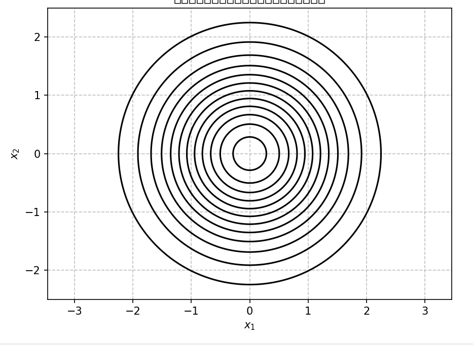
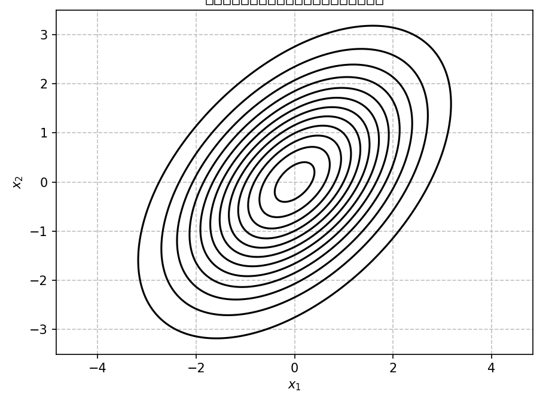
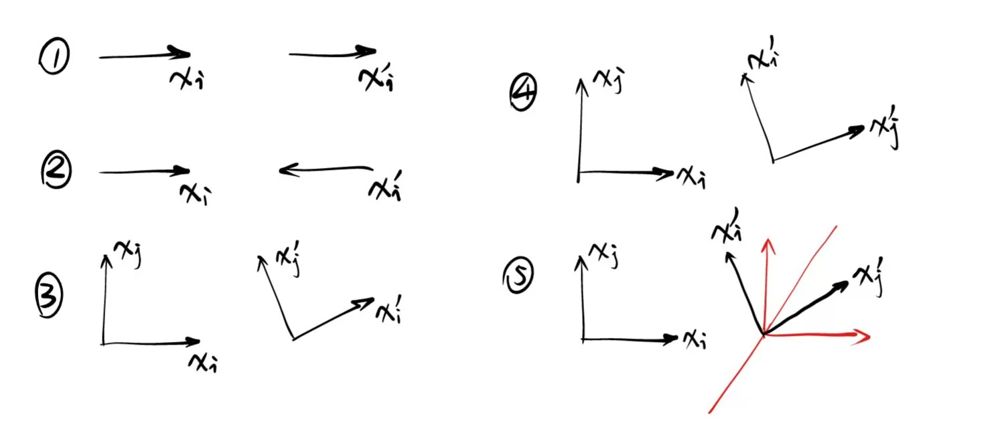
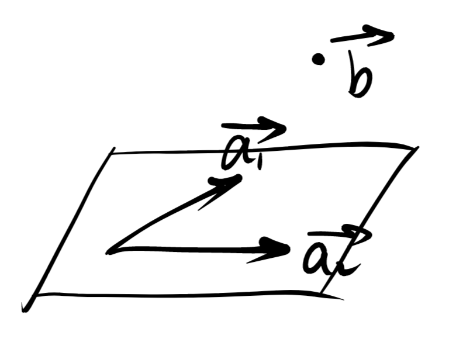
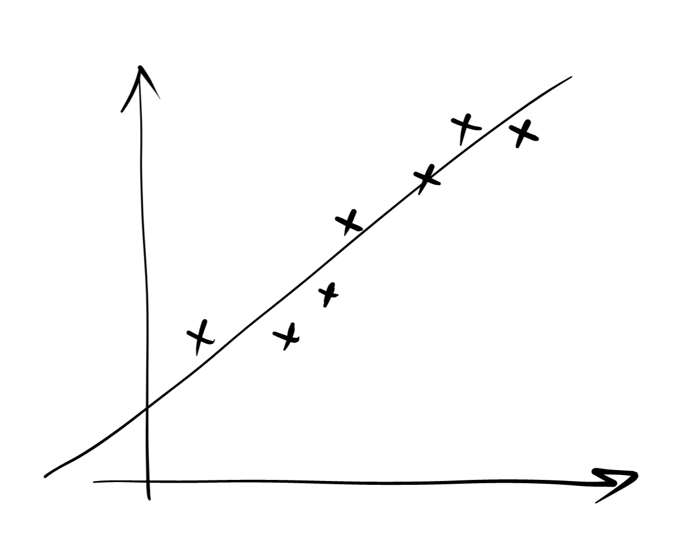
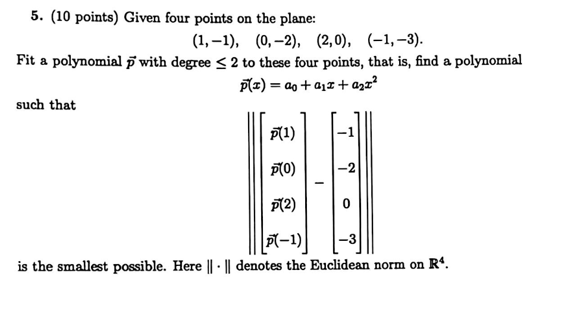

# Week13 习题课讲义

Topic：两种特殊算子矩阵——实对称矩阵与正交矩阵的相关理解、最小二乘法及其实际应用、一个彩蛋

### 从标准正交向量组到正交矩阵
有一组向量$\{\vec{v_1},\vec{v_2},……,\vec{v_n} \}$，彼此互相正交（点乘为0）且模长全部为1（自乘为1）。
这组向量可以看做一个n维向量空间的标准正交基，即一组性质非常好的基向量。

这组基向量写作矩阵的形式会有什么性质？
矩阵$P$：列向量构成一组标准正交基。
$P^TP$:非对角线相当于相互点乘、对角线相当于自乘。
$P^TP=I \Rightarrow P^T=P^{-1}$

### 再次复习：换基矩阵、换坐标矩阵、线性算子矩阵
* 换基矩阵：$V=UT$
* 换坐标矩阵：$U[\vec{x}]_u=V[\vec{x}]_v=UT[\vec{x}]_v \Rightarrow [\vec{x}]_u=T[\vec{x}]_v \Rightarrow [\vec{x}]_v=T^{-1}[\vec{x}]_u$
* 线性算子矩阵：坐标系$U$看来，线性算子矩阵为$A$；坐标系$V$看来，线性算子矩阵为$B$。则：$B=T^{-1}AT$，$T$为换基矩阵，可理解为：通过$T$矩阵代表的换基法则，可换到坐标系$V$中，此时对应的线性算子矩阵为$B$。

### 特殊算子矩阵1：实对称矩阵

第二个正态分布的协方差矩阵为：$
\begin{bmatrix}
2&1\\
1&2\\
\end{bmatrix}
$。代表的意义为：之前的概率采样为标准正态分布下的采样。将所有采样点进行此种线性变换，相当于在图二对应的正态分布概率模型下采样。

当前的等高线为椭圆，如何建模这种分布？

* 法一：仍在标准直角坐标系下建模。此时x y存在耦合关系，较为复杂，且难以直观捕捉形态特征
* 法二：运用二次型建模椭圆：$2x_1^2+2x_1x_2+2x_2^2=f$。
配方：$2(x_1+\frac{1}{2}x_2)^2+\frac{3}{2}x_2^2=f $，提取出新的基向量。
问题：解除了耦合关系，但仍然难以直观捕捉形态特征
* 考虑到：二次型的基向量重构方法不唯一：是否存在一组基向量重构方法，使其能够直观且非耦合地建模这个椭圆？
* 法三：考虑几何特征：椭圆长短轴方向。

根据法三的建模方法：
对于这种线性变换，相当于使原先的正圆沿长轴拉伸、沿短轴压缩$\Rightarrow$长短轴都是特征向量。

总结：实对称矩阵代表的线性变换（若矩阵的元素均为非负）相当于：标准正态分布向一般正态分布的变换。

### 再探二次型

除配方法外，我们找到了另一种重构基向量的方法。

原二次型矩阵为$A$，对角化为$D$，则矩阵$P$一定为正交矩阵:

$D=P^{-1}AP=P^TAP$
$\Rightarrow A=PDP^T$
$\vec{x}^TA\vec{x}=\vec{x}^TPDP^T\vec{x}=(P^T\vec{x})^TD(P^T\vec{x})=\vec{y}^TD\vec{y} $

$\vec{x}$：本体向量在标准直角坐标系下的坐标向量
$\vec{y}$：本体向量在新的坐标系下的坐标向量
如何理解$P$？

$P$的列向量为新的基向量$\Rightarrow V=UP$。当$U$代表标准直角坐标系，即$U=I$时，$P$为换基矩阵。
根据复习内容：该换坐标系方案中的换坐标矩阵为$P^{-1}=P^T$

$\Rightarrow P^T\vec{x}$代表：$\vec{x}$（原坐标向量）在新坐标系下的坐标向量，即为$\vec{y}$

### 特殊算子矩阵2：正交矩阵

正交矩阵代表的线性算子干了什么？

在标准直角坐标系中，原向量为$\vec{x}$，线性算子为$A$，是正交矩阵。施加线性算子后的向量变为：$A\vec{x}$

如何理解$A\vec{x}$？

$\vec{x}$为坐标向量。相当于$A$的列向量为一组基向量，$A\vec{x}$即为这组基向量形成的新坐标系下，$\vec{x}$为坐标的向量的本体向量，即标准直角坐标系中的坐标向量。

$\therefore A$为坐标系的基向量。（这对所有线性算子都适用）这组基向量的特征是什么？
$\Rightarrow$ 同样为标准正交。

这种“标准正交”的基向量组，与我们默认的标准直角坐标系的基向量组，存在什么样的转换关系？（互换的A矩阵有什么结构特点？$\Rightarrow$需要研究这种“互换”的规律特点）

* 二维空间中如何转换？
  * 高维的整体转换很难直接想象。但由于各个维度正好对应各个基向量，不存在耦合关系。所以可以逐个击破（每次只取一维或两维）。
  * 先取一维空间：自定义一组基，使这个维度中原先的基向量在这组基看来：要么不变，要么反射
  * 或直接取二维空间：自定义一组基，使这2个维度中原先的基向量在这组基看来：要么不变，要么反射
  * 二维空间旋转或瑕旋转。
* 三维空间中如何转换？

这些变换总共可总结成4种：
一维不变/一维反射/二维反射/二维旋转

如何对此用算子矩阵定量描述？
我们期望：在某组基看来，这种转换尽可能的简单（仅此四种基本变换）
**这组基即为：上述各维度基向量组合成的集合。**

对应的定量描述：
在某组基看来：
* 抽出其中一个基向量，在其代表的维度上：不变（线性算子矩阵为1）、反射（线性算子矩阵为-1）
* 抽出其中两个基向量，在其代表的两个维度上：
  * 反射：线性算子矩阵为$
\begin{bmatrix}
1&0\\
0&-1\\
\end{bmatrix}
$
  * 旋转：线性算子矩阵为$
\begin{bmatrix}
cos&sin\\
-sin&cos\\
\end{bmatrix}
$

对于这组基，我们再进行一些顺序的简单置换，使-1和1的位置重新整理，即为我们的典范式。

$\therefore$ 典范式代表的意义为：在某组基看来，这种正交矩阵算子的变换可以统一视作四种基本变换的组合。

### 最小二乘法

存在很多无法精确表示的问题，但我们能尽可能精确的拟合。

定义“损失函数”=$\|A\vec{x}-\vec{b}\|_2^2$
目标：使得损失函数最小化。

$\vec{x}$的求解：残差向量即为投影向量，即：与$A$的列空间中的所有向量正交。
$A^T(\vec{b}-A\vec{x})=0$
即：$A^T\vec{b}=A^TA\vec{x}$
$\vec{x}=(A^TA)^{-1}A^T\vec{b}$

线性拟合问题：
对于第$i$个数据点，有：
$y_i=k_1x_{i1}+k_2x_{i2}+……+k_nx_{in}+b$
写作向量形式：
$\vec{y}= [\vec{x_1} \vec{x_2} …… \vec{x_n}]^T(\vec{k} , b)^T=A^T\vec{k}$
最小二乘解即为拟合结果。

