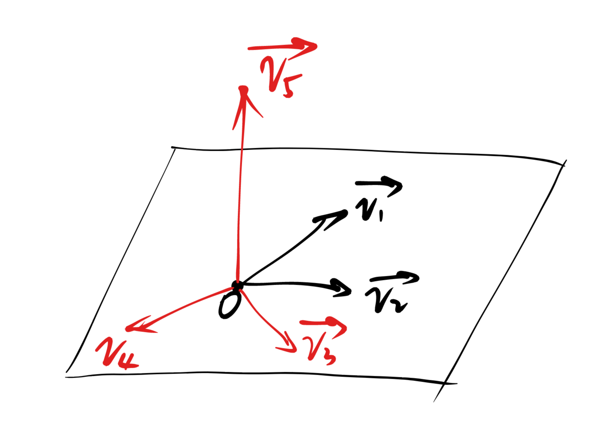
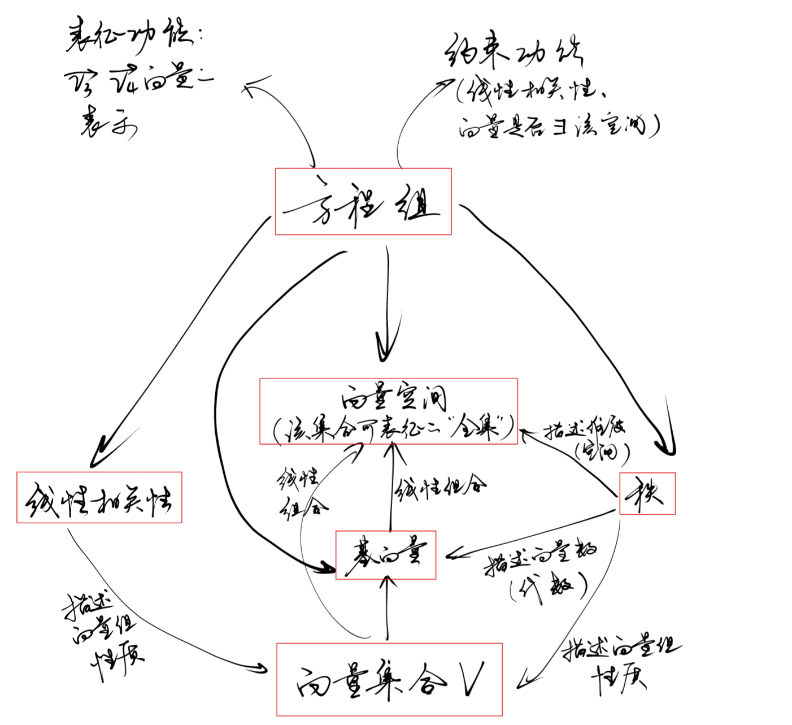

# Outline
* 线性相关/无关与线性方程组
* 向量空间与秩、基底

### 接上节课补充：线性相关/无关与方程组

空间上理解：（线性相关）：存在向量能被其他向量线性组合表示 （线性无关）：不存在向量能被其他向量线性组合表示

线性相关代数表示：
存在例如$\vec{x_3}=d_1\vec{x_1}+d_2\vec{x_2}$。（即：$a_1\vec{x_1}+a_2\vec{x_2}+a_3\vec{x_3}=\vec{0}$）
齐次方程的解情况：
令$\vec{x_1}=(x_{11},x_{12},x_{13})$，$\vec{x_2}=(x_{21},x_{22},x_{23})$，$\vec{x_3}=(x_{31},x_{32},x_{33})$
则$a_1\vec{x_1}+a_2\vec{x_2}+a_3\vec{x_3}=\vec{0}$转化成方程组：
$x_{11}a_1+x_{21}a_2+x_{31}a_3=0$
$x_{12}a_1+x_{22}a_2+x_{32}a_3=0$
$x_{13}a_1+x_{23}a_2+x_{33}a_3=0$
其中未知元为：$a_1 a_2 a_3$。
如果三向量线性无关：齐次方程组仅有零解
如果线性相关？
$x_3=c_1x_1+c_2x_2$
则原方程组转化为：
$x_{11}(a_1+c_1a_3)+x_{21}(a_2+c_2a_3)=0$
$x_{12}(a_1+c_1a_3)+x_{22}(a_2+c_2a_3)=0$
$x_{13}(a_1+c_1a_3)+x_{23}(a_2+c_2a_3)=0$
未知元视为两个整体。
$a_1+c_1a_3=0$
$a_2+c_2a_3=0$
即：$a_1 a_2 a_3$的解空间是一维。

与线性空间的关联：向量集合中有多少个“多余”的向量，线性方程组的解空间就有几个维度。
继续理解：说明线性方程组中有多少个无效的约束……
方程组：有效约束数量；向量空间：有效增加维数数量……
二者正好成相反的几何意义。即：向量组能长成几维向量空间，对应的线性方程组就能造成几维的约束。
$\Rightarrow$**零空间+行/列空间=总空间数**

### 例：课本引理2.10（继续探究线性相关性与方程组的关联）
如何体现向量空间与线性方程组的关联？

空间视角：r个向量最多建立起r维空间（每个向量增加0/1维）；s若线性无关：每个向量都能建立起新的一维$\rightarrow$总共s维。矛盾点：小于等于r，等于s

代数：唯一的抓手就是线性相关性的定义式$a_1Y_1+……+a_sY_s=0$,是否有非零解？（以此判断向量组的线性相关性）
$a_1(b_{11}X_1+b_{12}X_2+……+b{1r}X_r)$
$+a_2(b_{21}X_1+b_{22}X_2+……+b{2r}X_r)$
$+……$
$+a_s(b_{s1}X_1+b_{s2}X_2+……+b{sr}X_r)=0$（其中未知元为$a_i$）
即：
$c_1X_1+c_2X_2+……+c_rX_r=0$，仅有零解。
将$c_i$拆解：
$a_1b_{11}+a_2b_{21}+……+a_sb_{s1}=0$
$……$
$a_1b_{1r}+a_2b_{2r}+……+a_2b_{sr}=0$
是否有非零解？
方程数：r，未知元：s。s>r。一定有非零解：线性相关

**关于“空间视角向代数视角转换”的通式通法1**：利用线性相关性的基本定义列方程组，剩下的就是方程组解的数量的有关性质（上节课内容）

**总结：关于“空间视角”和“代数视角”** 及**利用空间视角过渡到代数视角解题的一般思路**
* 空间视角的基本语言是欧式向量，工具是欧式向量空间
* 代数视角的基本语言是方程约束，工具是线性方程组
* 结合二者的重要桥梁，是设法将空间问题列出线性方程组，然后探究方程组的性质得出代数层面的结论。这一结论往往能够映射到空间层面直观理解。
* 列方程组的重要角度（对于当前所学知识），一个是“线性相关性”的基本定义式，一个是向量空间的基底。

### 向量空间的秩、基底及更多重要概念的联系（针对向量组）

向量组的秩：
* Ex:仅有v1；v1&v2；v1&v2&v3；v1&v2&v3&v5

回顾上节课内容：线性无关说明每一个向量都能长成一个新的维度；线性相关说明存在向量对形成新的维度无关（定性分析）
定量分析：有多少向量能张成新的维度？（向量组的秩）

秩是否是固定值？
确定了秩之后：找出哪些向量能够“仅用这些向量就可以达成相等的张成效果”，即“取哪些向量就够用”？
上述为空间视角。代数视角：从一组线性相关向量中挑出一组向量，使其能张成相同的向量空间，并且线性无关（线性无关：又可以列方程组解决）（基向量不唯一！）

概念整理：给定一个向量集合V：线性组合、向量空间、基向量、秩、线性相关/无关、方程组

### 基向量在空间、代数视角的桥梁作用

几乎任何设计“维数”的问题，都可以转化成设基向量表示向量空间的问题。

* 例1：判断两个子空间相等

v1 v2张成的空间、v3 v4张成的空间，证明两个向量集合相等
思路：空间相等说明必存在一组共同的向量作为基向量
v3 v4本身也可以由v1 v2表示……
列方程组证明空间中任何一个向量都可以通过v1 v2线性组合而成

* 例2：判断两个子空间不相等

v1 v2张成的空间、v3 v5张成的空间，证明两个空间（向量集合）不相等
思路：空间不相等说明第一个空间的这一组基向量无法作为第二个空间的基向量
方程组：能用v3 v5表示出来的向量可能用v1 v2表示不出来

* 例3：两个子空间之和的维数

思路：尽可能找共同的基底（两空间方程组联立后的新方程组 解空间的基向量）
dim(V1+V2)=dim(V1)+dim(V2)-dim(V1V2)

证明：
* 共同基向量可以作为基底集合的一部分
* 要使得第一个空间能被完整表示：还需找到dim(V1)-dim(V1V2)个基向量，通过列方程组证明：这些基向量能表示第一个空间，但不能表示第二个空间（证明每个基向量都不在第二个空间当中，所以不能表示第二个空间中的任何一个向量）
* 第二个空间同理

### 矩阵的秩
与向量组的秩同理。

### 讲题
