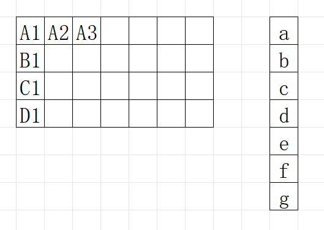
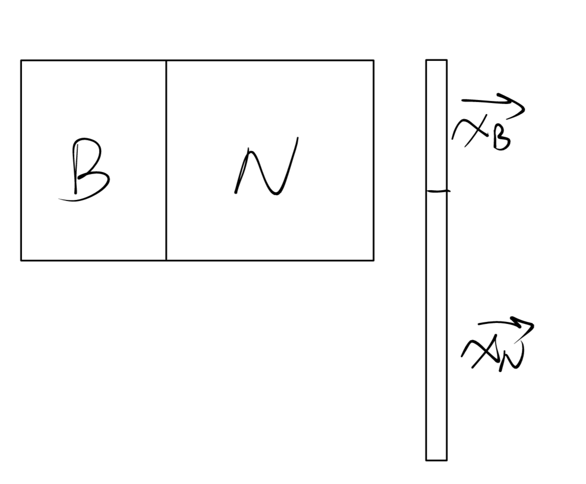
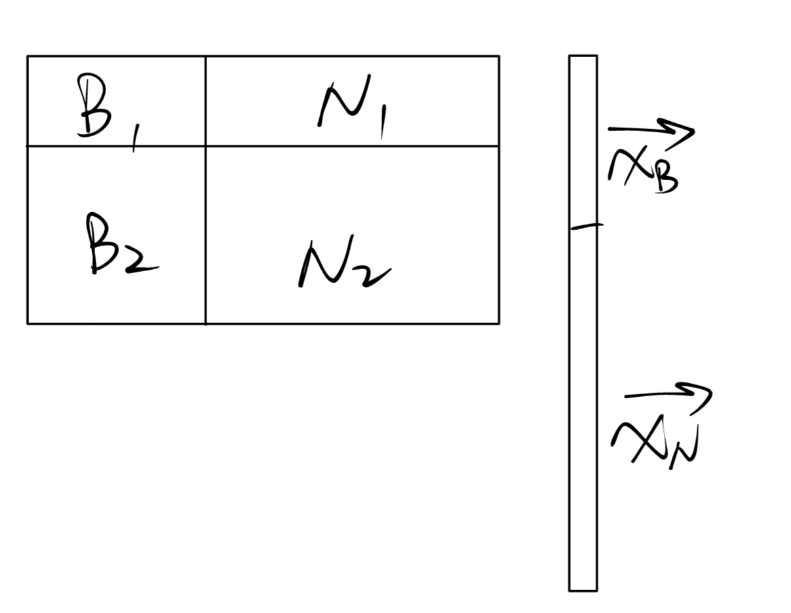
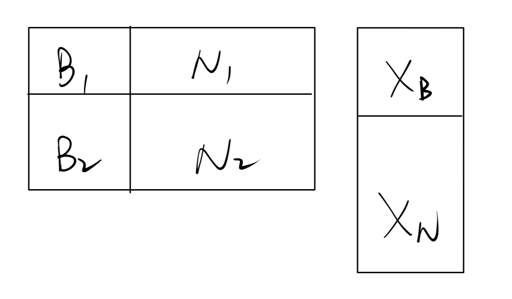

# Week4习题课讲义

### Outline
* 线性映射的直观理解
* 矩阵的本质、矩阵乘法运算及与线性映射、秩的关联（重点、难点）
* 矩阵加法的理解
* 分块矩阵运算推导与矩阵本质的关联

### 线性映射
$\phi(\vec{a}+\vec{b})=\phi(\vec{a})+\phi(\vec{b})$
$\phi(\lambda\vec{a})=\lambda\phi(\vec{a})$

考虑两种1维映射：$y=kx,y=kx^3$
令$\Delta=x_2-x_1$
$y_{\Delta}=k\Delta$
$y_{\Delta}=k\Delta*(x_1^2+x_1x_2+x_2^2)$
线性变换：$\Delta$相同时，映射值的相差量不会受具体坐标位置产生扭曲（如二次函数正负发生颠倒）或缩放（如三次函数）

$ \vec{y}=A\vec{x} $(线性变换)
令$\vec{\Delta}=\vec{x_2}-\vec{x_1} $
$ \vec{y_{\Delta}}=A\vec{x_2}-A\vec{x_1} $
由线性变换的定义：
$=A(\vec{x_2})+A(-\vec{x_1}) $
$=A(\vec{x_2}-\vec{x_1})$
$=A\vec{\Delta}$，映射值的相差量同样不会受具体坐标位置产生扭曲或缩放

##### 空间上的演示
1.降维操作
矩阵为$[2,1]$，向量为$[0,0][1,1][2,2]$

2.升维操作
矩阵为
$
\begin{bmatrix}
2 & 1 \\
3 & 2 \\
4 & 3
\end{bmatrix}
$
(矩阵的rank是多少？对应了张成子空间的维数是多少？是什么形状？)
向量为$[0,0][1,1][2,2]$

### 矩阵乘法

* 线性变换的空间上意义（几何意义）
* 描述线性变换的代数工具是矩阵$\Leftarrow\Rightarrow$描述向量空间的代数工具是方程组

考虑$A\vec{x}:$

* 理解方式1：向量数量积的匹配运算（从A矩阵各行的角度出发）

此时A矩阵的每一行都作为独立的向量存在，为向量数量积的一部分$\Rightarrow$矩阵此时的本质是各行向量的机械拼接

* 理解方式2：各列向量的线性组合（从$\vec{x}$各元素的角度出发）

运算结果第一行：aA1+bA2+cA3+……
运算结果第二行：aB1+bB2+cB3+……
运算结果第三行：aC1+bC2+cC3+……
运算结果第四行：aD1+bD2+cD3+……

重组运算结果：
$a\vec{a_1}+b\vec{a_2}+……+g\vec{a_7}$

即：矩阵乘法实际上是A矩阵各列向量的线性组合。列向量的系数取决于$\vec{x}$的各元素

此时A矩阵的每一列都作为独立的向量存在，为向量组线性组合运算的其中一个向量$\Rightarrow$矩阵此时的本质是各列向量的机械拼接

**矩阵的本质：行层面或列层面上若干向量的机械拼接。各向量之间独立，不产生任何相互关系$\Rightarrow$若为行向量的拼接，则增删其中的若干行向量，造成的影响仅仅为机械增删运算对象带来的影响，而其他运算对象不受任何牵连。**

思考：矩阵乘法的本质为线性组合$\Rightarrow$线性组合张成一个向量空间$\Rightarrow$
* 张成的向量空间有几维？
* 如何用矩阵乘法描述这个空间？
* 如果$\vec{x}$确定，则运算结果的几何意义是什么？

rankA即为：A的列向量能够张成向量空间的维数（穷尽所有$\vec{x}$取值所能张成的极限）

$\vec{x}$取若干值，与A相乘得到若干向量。$\Rightarrow$将这些若干$\vec{x}$取值拼接？

$\Rightarrow$右矩阵B仍是一系列向量的机械拼接！

运算结果为一个矩阵（若干列向量的机械拼接），rank的上限为rankA（取得较好：正好能张成rankA；取得不好：如全部线性相关）。但与B矩阵rank的关系？

考虑A矩阵的最简情况（A向量）：此时运算结果即为A向量中每个元素对B的行向量做线性组合。

即：B矩阵各行向量张成空间的维度？若A向量也取若干个特殊值拼接成一个矩阵？

双上限：rankA rankB。

总结：
* 矩阵*矩阵的本质是矩阵\*向量结果的机械拼接
* 矩阵*向量的本质是向量组的线性组合，这里的矩阵也是此处“向量组”的机械拼接

### 矩阵加法

符合直觉。但为何合理？

$(A+B)\vec{x}$：写成线性组合形式？
$A\vec{x}+B\vec{x}$：写成线性组合形式？
期望二者相等，才能符合线性变换的分配率。

### 分块矩阵

令列向量线性组合运算为L。则运算结果为：
$L(B)+L(N)=B\vec{x_B}+N\vec{x_N}$

仅有的区别：$L(B)$中的B，每个向量表示为上下两部分的拼接形式。N同理。
则结果为：
$
\begin{bmatrix}
B_1\vec{x_B}\\
B_2\vec{x_B}
\end{bmatrix}
$ + $
\begin{bmatrix}
N_1\vec{x_N}\\
N_2\vec{x_N}
\end{bmatrix}
$
（仍是单个列向量）
等效于$B\vec{x_B}+N\vec{x_N}$

若有多个$\vec{x}$？
机械拼接。运算结果的各列向量为：
（$
\begin{bmatrix}
B_1\vec{x_{1B}}\\
B_2\vec{x_{1B}}
\end{bmatrix}
$ + $
\begin{bmatrix}
N_1\vec{x_{1N}}\\
N_2\vec{x_{1N}}
\end{bmatrix}
$），（$
\begin{bmatrix}
B_1\vec{x_{2B}}\\
B_2\vec{x_{2B}}
\end{bmatrix}
$ + $
\begin{bmatrix}
N_1\vec{x_{2N}}\\
N_2\vec{x_{2N}}
\end{bmatrix}
$），……
写为：
$
\begin{bmatrix}
B_1{X_B}\\
B_2{X_B}
\end{bmatrix}
$ + $
\begin{bmatrix}
N_1{X_N}\\
N_2{X_N}
\end{bmatrix}
$