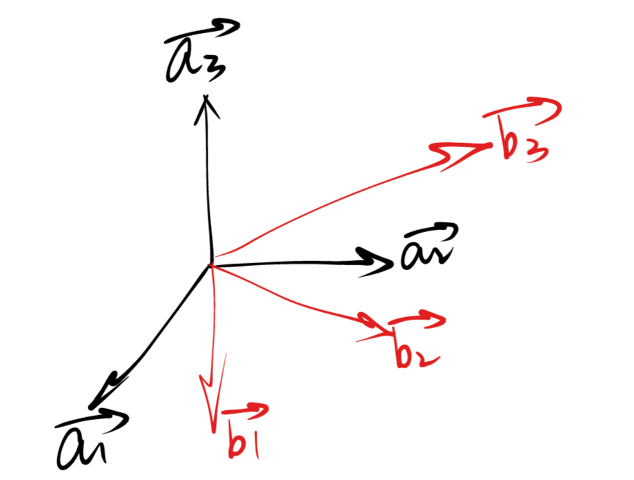
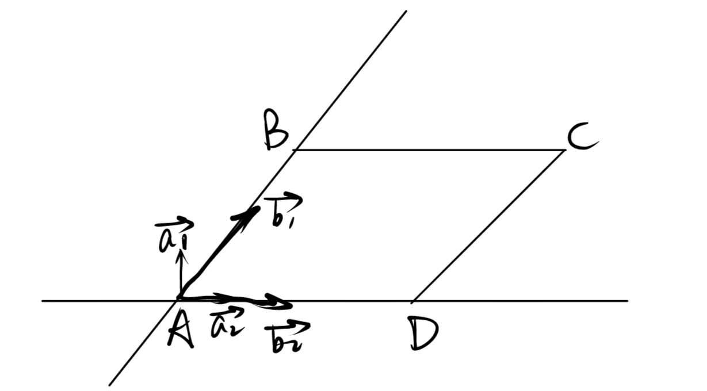
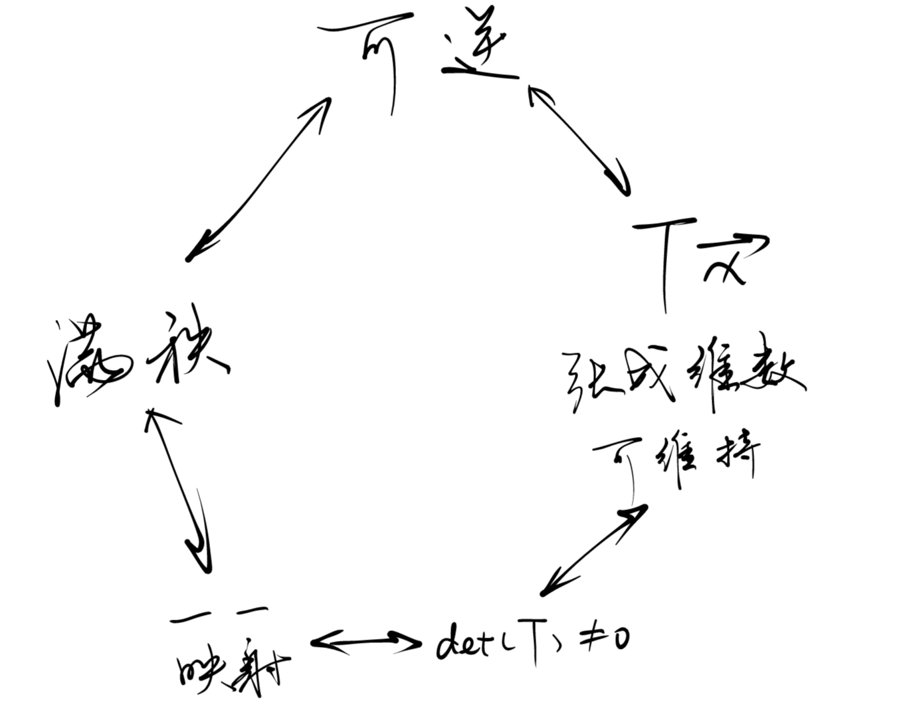

# Week7 习题课讲义
Topic：换基/换坐标问题与变换可逆性、行列式性质的串讲

### A=BS问题
Problem：三维空间中向量$\vec{v}=x_{a1}\vec{a_1}+x_{a2}\vec{a_2}+x_{a3}\vec{a_3} $。如何将其表示成$\vec{v}=x_{b1}\vec{b_1}+x_{b2}\vec{b_2}+x_{b3}\vec{b_3} $的形式？（如何求出\vec{b_i}的各系数？）

向量组$\vec{b}$也是相同向量空间中的一组基向量
$\Rightarrow$任何一个$\vec{a_i}$向量，都可以用$\vec{b_i}$表示（此处和可逆性关联）
$\Rightarrow \vec{v}=x_{a1}(s_{11}\vec{b_1}+s_{12}\vec{b_2}+s_{13}\vec{b_3})+x_{a2}(s_{21}\vec{b_1}+s_{22}\vec{b_2}+s_{23}\vec{b_3})+x_{a3}(s_{31}\vec{b_1}+s_{32}\vec{b_2}+s_{33}\vec{b_3})$
写成矩阵形式：
$\vec{v}=[\vec{b_1} \vec{b_2} \vec{b_3}][\vec{s_1} \vec{s_2} \vec{s_3}]\vec{x_a}$
其中：$\vec{s_i}=[s_{i1},s_{i2},……,s_{in}]$，代表单个$\vec{a_i}$向$\vec{b}$向量组的分拆方法
$\Rightarrow \vec{v}=A\vec{x_a}$（原先的基向量组和基向量坐标）
$=BS\vec{x_a}$（变化后的基向量组、描述$\vec{a}$拆解成$\vec{b}$的矩阵、原先的基向量坐标）

**如何理解$A=BS$？**
回顾矩阵乘法的本质：左矩阵的各列向量做线性组合$\Rightarrow B$矩阵的每一列$\vec{b_i}$向量做n种线性组合。第i种线性组合的系数即为S矩阵的第i列。即为$\vec{a_i}$拆解成各个$\vec{b}$的系数。

**如何理解$A\vec{x_a}=BS\vec{x_a}$？**
重新表示：$A\vec{x_a}=BS\vec{x_a}=B\vec{x_b}$
$\vec{x_b}$即为B坐标系下的坐标向量！

**$\vec{x_a}$和$\vec{x_b}$的关系？**
$\vec{x_b}=S\vec{x_a}$
符合直觉的事实：只要一个向量在原坐标系A中拥有唯一坐标，该向量在新坐标系B中仍然拥有唯一坐标
$\Rightarrow S$即为坐标向量之间的一一映射！
$\Rightarrow$ 另一个符合直觉的事实：只要一个向量在新坐标系B中拥有唯一坐标，则在原坐标系A中也一定拥有唯一坐标
$\Rightarrow$ 假如我们知道$\vec{x_b}$，我们是不是也可以推导出$\vec{x_a}$？（Problem *）

### B=AT问题及可逆推导
我们试图从两种方向解决Problem *

**方向1：**
$\vec{x_b}=S\vec{x_a}$
S是否可逆？
$\Rightarrow$ 如果S不可逆，即S中存在列向量是线性相关的：
$\vec{s_i}=\lambda \vec{s_j}$：$\vec{a_i}$向$\vec{b}$向量组的分拆方法，与$\vec{a_j}$向$\vec{b}$向量组的分拆方法线性相关，即：$\vec{a_i}$与$\vec{a_j}$线性相关（原基向量组存在两个共线的基向量），显然是错误的
$\Rightarrow S$可逆！

所以这种变换法则$S$存在逆变换$S^{-1}$
变换法则$S$代表从A向量组坐标向B向量组坐标的变换……
$S^{-1}$是什么变换？
$\Rightarrow$B向量组坐标向A向量组坐标的变换！
即：$\vec{x_a}=S^{-1}\vec{x_b}$

**方向2：** 课本上对于$B=AT$的推导。
这种推导的思路与$A=BS$的推导完全一致：一个$\vec{b_i}$，能怎么分拆成A向量组的线性组合。
根据之前的推导，我们也很容易用同样的方法推出：$\vec{x_a}=T\vec{x_b}$

**方向1、2的综合考虑**：
$\vec{x_a}=S^{-1}\vec{x_b}$
$\vec{x_a}=T\vec{x_b}$
即：推导出的$T$其实就是$S$的逆变换！

### 可逆性与行列式性质的关系
在没有平行四边形面积公式，只知道ABCD四点在直角坐标系下坐标$\vec{x_a}$的情况下，如何求出平行四边形ABCD的面积？

法一：在直角坐标系a下使用微积分（二重积分）计算
法二：平行四边形在坐标系b下的坐标为$(x_{b1},x_{b2})$，可通过换坐标系操作由a坐标系坐标$\vec{x_a}$求出。
我们只需知道b坐标系下(1,1)围成的图形面积，再缩放$x_{b1}*x_{b2}$倍即可。

“b坐标系下(1,1)围成的图形面积”？
$\vec{x_a}=T\vec{x_b}$，即可求出$\vec{x_a}=T(1,1)$（此时T为二维矩阵）
$\Rightarrow$ b坐标系下(1,1)围成的图形面积即为a坐标系下T(1,1)围成的图形面积
$\Rightarrow$ 即为T的行列式的绝对值

Summary:
* T矩阵本身表征了坐标系的变换规则
* $\Rightarrow$确定了新坐标系下的坐标情况，即可推断原坐标系下的坐标情况
* T矩阵的行列式表征了坐标系变换对于尺度的伸缩情况
* $\Rightarrow$确定了新坐标系下的相对尺度大小，即可推断原坐标系下的相对尺度大小。即：只要知道其中某个坐标系下1单位“相对尺度大小”的绝对数值，即可推出绝对数值情况（这在大一下学习的二、三重积分计算、大二学习的概率论随机变量替换问题中都会继续应用）

### 方阵可逆相关的触发性质总结

前提：变换法则T是可逆的……
如果不可逆？
* 向量组A能张成2维空间，向量组B的两基向量共线$\Rightarrow$仅能张成1维空间
* 对于方阵T，rank(T)=1
* 方阵T代表的变换无法维护变换前后空间维数的恒定
* 方阵T无法表征一个一一映射（一整维的向量全部压缩到一点，无法反向映射，这直接对应了“不可逆”的直观意义）
* 行列式为0（压缩到了一起）
