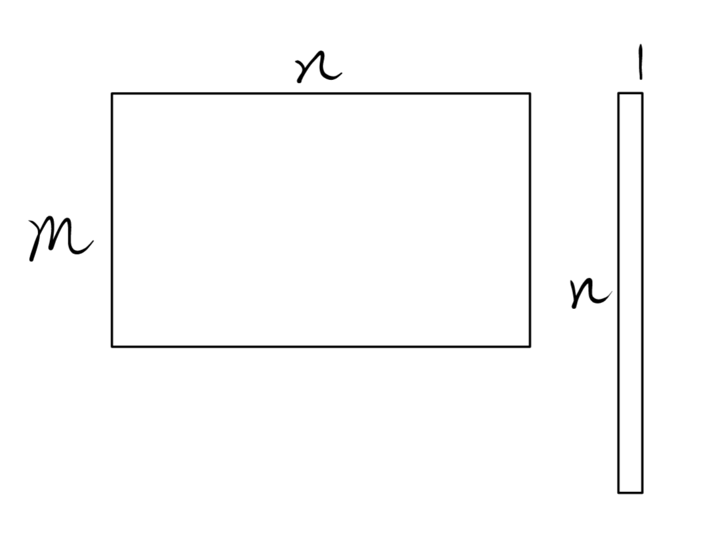
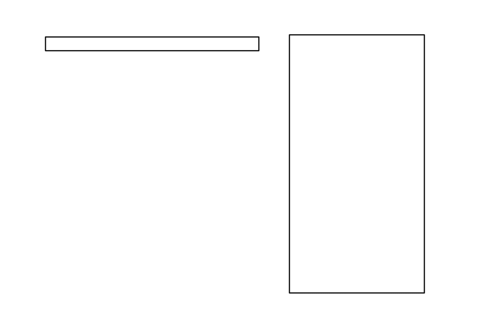

# Week8 习题课讲义

Topic：期中复习。仅提供大致的知识框架和较为重要的知识点串联，仅作为复习的大致方向参考与相关知识、思想的温习巩固，**不作为任何复习方案的建议！**

### 1.1
**重点1：高斯消元的计算方法（教材P4）**
**重点2：由阶梯型判断解的数量（教材P5）**

重温知识点：
* 方程组的意义是对原始空间进行约束
* 有效约束造成的结果是可行解空间维数-1
* 在阶梯型中，有效约束体现为前r行的形式（P4），无效约束体现为0=0的形式，无解约束体现为0=$h_m\neq 0$的形式
* 初等变换不改变解，在空间上体现为约束空间沿交线旋转

$\Uparrow$ 以上基本对应了1.1中的各个定理、推论，基本都在围绕“高斯消元”的正确性、“解的数量”相关的性质

### 1.2
齐次线性方程组 $A\vec{x}=\vec{0}$ 其实就是一般线性方程组 $A\vec{x}=\vec{b}$ 的特殊形式，共享了1.1中的计算方法与解的数量判断方法。但存在其他的少量特殊性质

**重点1：初步认识解空间（定理1.9，教材P7）**
所有方程组的解（有解情况下）要么是0维（单个解），要么无数个（$\geq 1$维）。也就是说解集是一个向量空间
$\Rightarrow$ 向量空间意味着空间中向量的线性组合仍在向量空间中，这就是定理1.9的内容
$\Rightarrow$ 向量空间还意味着能找出基向量：找出这样一组基向量，就可以表示出整个解空间$\Rightarrow$这就是1.3中“通解”的本质

### 1.3
**重点1：通解（教材P11 12）**
解可以表示为：$(1,3,0)+c(0,-3,1)$，即：向量空间/解空间的原点是$(1,3,0)$，共有一维。$(0,-3,1)$就是这个空间的基向量。这与后面的基础解系概念息息相关。

**重点2：增广矩阵形式方程组的求解（教材P11）**
本质在于方程组能写成$A\vec{x}=\vec{b}$的形式，这也印证了2.3节整节的重点思想：矩阵是向量的拼接。
一定要掌握计算方法！

### 1.4
**重点1：方程组解的行列式表示**

### Chapter1总结
* 计算问题
  * 高斯消元解线性方程组
  * 增广矩阵解线性方程组（仅仅是换了一种形式而已）
* 本质理解与证明思想——线性方程组与向量空间的串通
  * 方程本质上是对解空间维数的约束（需判断是否有效、是否有解），相关涉及到的部分是解的数量判断（解空间维数的求解）、通解的主元数量（也代表了解空间的维数）

### 2.1

**重点1：线性相关性的理解（教材P22）**
* 线性相关性是对向量组性质的描述而非向量空间性质的描述
* 直观理解：向量组中是否存在能相互线性表示的一组向量/线性无关的一组向量：每个向量都能独立参与空间中一个维度的张成
* 有且仅有的代数工具：线性组合为0的解（详见2.4~2.7，所有证明全部都从这个公式出发）

**重点2：基向量（教材P24）**
* 一组向量：能张成所需的向量空间V，且该组向量线性无关
* 向量空间本身有无穷多个向量，很难在代数证明上直接应用$\Rightarrow$基向量即为向量空间最重要的抓手（通过有限的向量代表整个向量空间）
* 一个十分重要的证明思想就是：向量空间中的所有向量都可以设法用这个空间的基向量表示（引理2.10，教材P25，综合应用了这个思想和线性相关性的代数工具，同时体现了线性方程组作为代数证明工具的重要作用）

**重点3：dim（教材P26）与rank（教材P27）**
dim是对向量空间性质的描述，rank是对向量组性质的描述。而这两种描述方法都直接取决于向量空间/向量组的基向量数量。

### 2.2

**重点1：行列空间、行秩列秩**
* 行空间、列空间：只不过是行向量、列向量张成的空间。**（教材P29）** 再一次印证了“矩阵是向量拼接”的思想
* 行秩、列秩的定义：行向量组的rank/行空间的dim、列向量组的rank/列空间的dim **（教材P30）**。仍然在“向量组”的角度下理解定义。
* 初等行变换不改变行空间、可能改变列空间但不改变列秩 **（教材P30）**
* 在此基础上，我们可以证明行秩列秩相等 **（教材P31）**。这一部分我们很难进行直观的理解，但结论一定要记住。
* 通过这个结论我们可以知道：矩阵的秩从行列角度理解都可以。

这一节的内容与之前存在高度的重合，因为矩阵问题本质上都可以被抽象成向量组的问题。

### 1.1~2.2相关思想的总结

#### 注：2.3及以后的内容同样与之前章节存在大量的重合，只要对向量空间有充分的认识，能够运用向量空间与方程组等代数工具的结合，就没有太多新的概念。

### 2.3
**重点1：线性映射的定义（教材P35）**
**重点2：矩阵乘法基础**
* 运算法则
* 基本性质 **（教材P40）**

**重点3：矩阵乘法本质的理解（在相关证明中也会大量运用）**
  
* 图1：列向量的线性组合
* 图2：行向量的线性组合
* 图1的右侧变为矩阵：有限个线性组合结果的向量组拼接
* 图2的左侧变为矩阵：有限个线性组合结果的向量组拼接
* 由图1可推出：线性组合结果向量组的rank不大于rank(左矩阵)
* 由图2可推出：线性组合结果向量组的rank不大于rank(右矩阵)
* 可推出：$rank(AB)\leq rank(A)rank(B)$

**重点4：矩阵加法、矩阵转置等运算**

### 2.4
**重点1：可逆矩阵**
* 可逆矩阵的本质是可逆的线性映射法则。**（教材P49）** 也就是说，矩阵在此处表征的是一个线性映射的法则，矩阵可逆则说明这个映射法则可逆。
* 可逆的相关触发性质 **（教材P50）**

**重点2：可逆变换/可逆矩阵的拆解（教材56-58）**
* 任何可逆变换都可以拆解成单步变换的组合。表征成矩阵的形式即为：一个可逆矩阵=一串初等矩阵的乘积。

**重点3（特别重要）：逆矩阵的计算（教材P59）**
不言而喻。自己练习。

### 2.5 解空间
**重点1：解空间、约束矩阵A的维度关系（定理2.40）（教材P63）**
早在第一章就已讲过：约束矩阵A的rank=有效约束的维数=原始空间$R^n$受约束而损失的维数；解空间=原始空间受到一系列约束后剩下的维数。损失维数+剩余维数=原始空间总维数n。

**重点2：特解、通解、基础解系的计算（教材P65-68）**
不言而喻。自己练习。

### Chapter3
本章的证明内容大大减少，更加偏重基础知识的理解和基础计算。包括相关的作业习题也大多数以计算为主。请大家自己查漏补缺，多加练习。