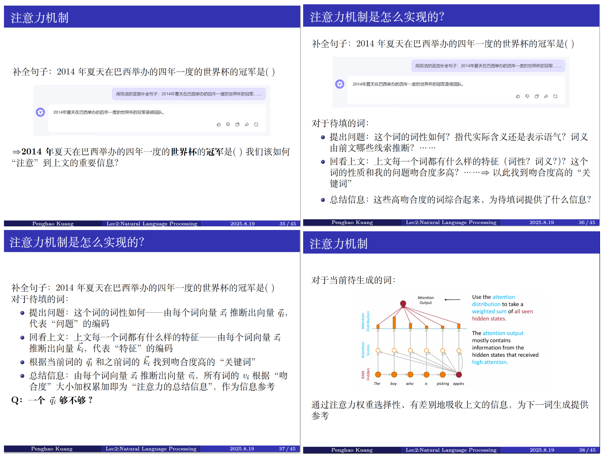

# Week9习题课讲义

Topic:线性代数在语言模型中的应用（由于4.1的内容已经在week7习题课讲完，本周讲一些扩展性的知识，供大家开阔视野）

### 从向量的本质到词汇编码

Week1习题课：“什么是向量？” $\Rightarrow$ 任何事物都需要通过数值编码进行量化的处理，编码而成的一系列数码组合就是向量
* 欧式空间中的坐标即为“欧式空间中的一点”的编码
* $A\vec{x}=\vec{b}$中的$\vec{x}$即为$A$矩阵列向量线性组合方式的编码

自然语言文本由一个个词汇构成，这些不同的词汇如何进行编码？

**Idea1：词汇到单个数值的一一映射**
但这无法很好地表征不同词汇之间的语义关系

**Idea2：将自然语言的语义视为一个空间**
假设有一系列国家名称词汇：
```
China Russia Canada Liechtenstein
```
简化情况：一个二维空间，第一维度表示“领土面积”，第二维度表示“人口数量”
* 每个词汇（token）编码成二维向量，可以看出不同词汇之间存在的语义特点
* 向量之间也存在线性运算：两词向量的差往往代表“语义之间存在的差别”$\Rightarrow$ $\vec{Italy}-\vec{German}=\vec{Mussolini}-\vec{?}$

GPT-3中，使用2048维语义空间，即2048维词向量进行token编码


### 如何进行词汇编码？
一个语言学规律：一个词本身的词义可以通过上下文的词汇，而非自身的特征定义。
我们可以设计一种机制，使得原始的词向量通过综合上下文的信息以丰富词义。

原始词向量：一系列随机向量
词义填充的步骤：
* 文本中的每个词原始词向量为$\vec{x_i}$
* 每个词向量：通过三个矩阵$W^Q, W^K, W^V$，分别得到$\vec{q_i}, \vec{k_i}, \vec{v_i} $
  * 这里$W^Q,W^K$矩阵的每一列代表：对于第$i$语义维度，单位语义强度所具备的“问题”编码、“特征”编码、“返回信息”编码
  * 例如：语义空间第$i$维代表“词性是动词”。$W_Q$该列向量代表：“这个词是不是动词”这一信息的编码，$W_K$该列向量代表：“这个词有动词词性特征”这一信息的编码，$W_V$该列向量代表：“这个词是动词时返回的信息”编码。如果语义空间其他维度代表“此行是名词”、“词语表示这是一个人名”、“词语表示某种颜色”……同理。
* 对于第$i$位置的token，使用$\vec{q_i}$与其他位置的$\vec{k_j}$进行点积得到“吻合程度”，作为$j$位置“返回信息”的权重$\Rightarrow \vec{q_i}K^T$ $\Rightarrow Normalization(\vec{q_i}K^T) \Rightarrow Normalization(\vec{q_i}K^T)V$
* 对于所有位置：$Normalization(QK^T)V$

Example："The curious cat quietly climbed the tree to chase a butterfly."

